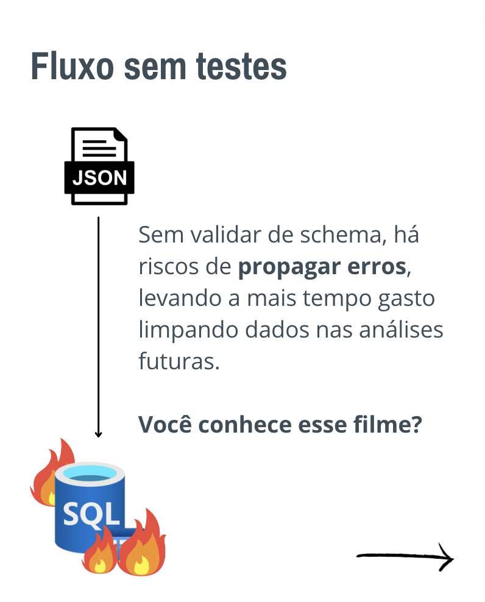
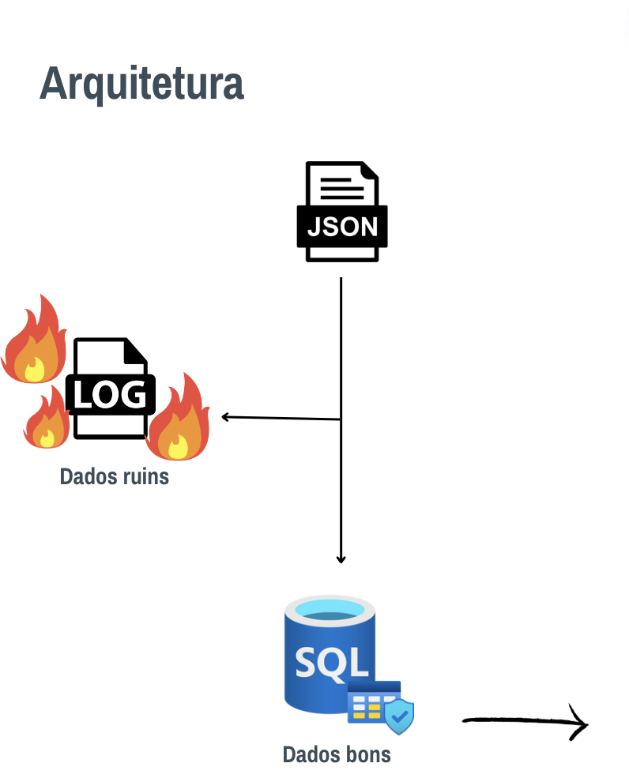

# Pydantic-101: Garantindo a Qualidade dos Dados

O `Pydantic-101` é um projeto que demonstra a validação de dados usando a biblioteca Pydantic em Python. Ele simula um ETL simples, lendo registros de um arquivo JSON e salvando-os em um CSV após validação.

## Instalação

### Usando pip

Para começar, clone este repositório em sua máquina local:

```bash
git clone https://github.com/lvgalvao/Pydantic-101.git
```

Navegue até o diretório do projeto:

```bash
cd Pydantic-101
```

Recomenda-se criar um ambiente virtual para instalar as dependências:

```bash
python -m venv venv
source venv/bin/activate  # No Windows: .\venv\Scripts\activate
```

Instale as dependências necessárias:

```
pip install -r requirements.txt
```

### Usando Poetry

Se preferir usar Poetry:

```
poetry install
poetry shell
```

## Uso

Depois de configurar o ambiente, você pode executar o script principal:

```
python pipeline.py
```

Isso lerá os registros do arquivo `data/sales_records.json`, validará cada registro e salvará os registros válidos em `data/valid_records.csv`. Registros inválidos serão registrados em `data/invalid_records.log`.

## Arquitetura

### Arquitetura Inicial



### Arquitetura Final



## Funcionalidades

* **Validação de Dados:** Garante que cada registro do arquivo JSON atenda a critérios específicos antes de ser processado.
* **Logs de Erros:** Qualquer registro que não passe na validação será registrado com detalhes do erro.
* **Integração com Pandas:** Usa o Pandas para ler e salvar arquivos, aproveitando sua eficiência e facilidade de uso.
